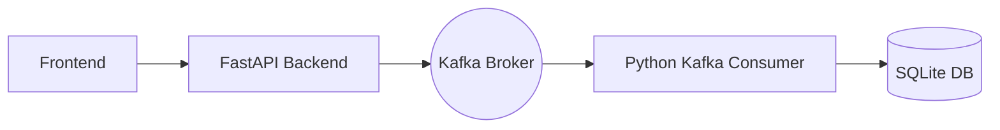

# 🧠 Math Microservice - FastAPI + Kafka + React

This project is a full-stack microservice application that allows users to interact with a set of mathematical operations through a web interface. It consists of:

- 📦 **Backend**: FastAPI REST API exposing math operations and user authentication
- 🌐 **Frontend**: React + Vite UI for user interaction
- 🔁 **Kafka**: Used for logging user actions and tracking events
- 🧾 **Consumer**: Kafka consumer that stores logs in a local SQLite database
- 🐳 **Docker**: Containerized with Docker and orchestrated via Docker Compose

---

## 📂 Project Structure

```
math_microservice/
├── backend/
│   ├── main.py
│   ├── routers/
│   ├── auth/
│   ├── utils/
│   └── requirements.txt
├── consumer/
│   ├── consume_and_store.py
│   └── Dockerfile
├── frontend/
│   ├── src/
│   └── Dockerfile
├── infra/
│   └── zookeeper-kafka/
│       ├── kafka/
│       ├── start.sh
│       └── Dockerfile
├── docker-compose.yml
└── .env
```

---

## 🚀 Features

- ✳️ Math API (addition, subtraction, etc.)
- 🔐 User registration & JWT-based login
- 🧪 Kafka integration with retry logic
- 📄 Kafka logging persisted to SQLite
- 📊 Live event logging with Prometheus & Grafana (optional)
- 🐳 Dockerized and ready to deploy

---

## 🧰 Technologies

- **Backend**: Python, FastAPI, Uvicorn, SQLAlchemy, Pydantic
- **Frontend**: React, Vite, TailwindCSS
- **Kafka**: Apache Kafka, zookeeper
- **Consumer**: Python + SQLite + Kafka-Python
- **Logging**: Prometheus client, JSON logger
- **DevOps**: Docker, Docker Compose

---

## ⚙️ Environment Variables

Create a `.env` file in the root:

```env
KAFKA_ADVERTISED_LISTENERS=PLAINTEXT://zookeeper-kafka:9092
KAFKA_LISTENERS=PLAINTEXT://0.0.0.0:9092
KAFKA_ZOOKEEPER_CONNECT=localhost:2181
```

---

## 🐳 Running the Application

1. **Build & Run all services**

```bash
docker compose up --build
```

2. Open in browser:

- Frontend: [http://localhost:5173](http://localhost:5173)
- Backend API docs: [http://localhost:8000/docs](http://localhost:8000/docs)

---

## 🧪 Backend Usage

**Endpoints:**

- `POST /register` — Register new user
- `POST /token` — Login and get JWT
- `GET /math/add` — Add numbers (secured)
- `GET /math/subtract` — Subtract numbers (secured)

**Logging:**

- All operations are sent to a Kafka topic (`logs`)
- The `consumer` listens and writes data to a local SQLite file (`events.db`)

---

## 🔄 Kafka Logging Architecture



---

## 🧪 Testing Locally

Run FastAPI standalone (for development):

```bash
cd backend
uvicorn main:app --reload --host 0.0.0.0 --port 8000
```

Run frontend with Vite dev server:

```bash
cd frontend
npm install
npm run dev
```

---

## 🔐 Authentication

Uses `python-jose`, `passlib[bcrypt]`, and `PyJWT` for:

- JWT Token generation
- Password hashing and validation
- Role-based endpoint protection

---

## 🗂 Kafka Topics

| Topic | Description         |
|-------|---------------------|
| logs  | Math events & logs  |

---

## 🧹 Troubleshooting

- ❌ **`Kafka not ready... retrying`**: Kafka container may be initializing — wait a few seconds.
- ❌ **`ModuleNotFoundError: No module named 'dotenv'`**: Ensure all dependencies are listed in `requirements.txt`.

---


